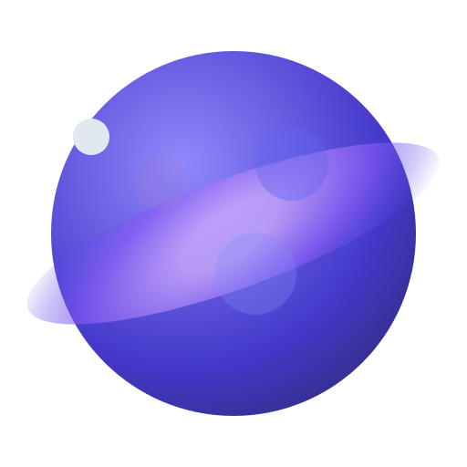

# Gravitas - Interplanetary Weight Calculator

<div align="center">
    
    <h3>Discover your weight across the solar system</h3>
</div>

## 🌌 Overview

Gravitas is an interactive web application that lets users explore how their weight would change on different planets in our solar system. With beautiful cosmic animations, real planetary data, and integration with NASA's Astronomy Picture of the Day API, Gravitas offers both educational value and visual appeal.

## ✨ Features

- **Interactive Weight Calculator**: Enter your Earth weight and discover how much you would weigh on other planets
- **Animated Planet Cards**: View detailed information about each planet with animated planetary orbits
- **NASA APOD Integration**: Explore random astronomy pictures from NASA's Astronomy Picture of the Day archive
- **Responsive Design**: Optimized for both desktop and mobile devices
- **Graceful Error Handling**: Intelligent fallbacks for images and network issues
- **Stunning Space Visuals**: Animated cosmic backgrounds with stars, dust, and planetary motion

## 🚀 Tech Stack

- **React**: UI library for building the interactive interface
- **Vite**: Fast and efficient build tool and development server
- **Framer Motion**: Advanced animation library for fluid motion effects
- **Tailwind CSS**: Utility-first CSS framework for responsive design
- **NASA APIs**: Integration with NASA's Astronomy Picture of the Day (APOD) API

## 📱 Mobile Optimization

Gravitas is fully optimized for mobile devices:

- **Responsive layouts**: Adapts to any screen size with appropriate spacing
- **Touch-friendly controls**: Large tap targets and intuitive gestures
- **Performance optimized**: Reduced animations on smaller devices
- **Viewport configuration**: Proper meta tags for mobile scaling
- **Accessible design**: Clear typography and sufficient contrast ratios

## 🔧 Installation and Setup

1. Clone the repository:
   ```bash
   git clone https://github.com/IhabProjects/gravitas.git
   cd gravitas
   ```

2. Install dependencies:
   ```bash
   cd frontend
   npm install
   ```

3. Start the development server:
   ```bash
   npm run dev
   ```

4. Build for production:
   ```bash
   npm run build
   ```

## 🧩 Project Structure

```
frontend/
├── public/               # Static assets
├── src/
│   ├── components/       # React components
│   │   └── PlanetCard.jsx # Planet display component
│   │   └── utils/            # Utility functions
│   │   │   ├── planets.js    # Planet data and calculation
│   │   │   └── nasaApi.js    # NASA API integration
│   │   ├── App.jsx           # Main application component
│   │   ├── main.jsx          # Entry point
│   │   └── index.css         # Global styles
│   └── index.html            # HTML template
```

## 🌟 Key Technical Implementations

### Dynamic Weight Calculation

The app uses gravitational ratios to accurately calculate how Earth weight translates to other planets:

```javascript
export const calculatePlanetWeight = (earthWeight) => {
  return planets.map(planet => ({
    ...planet,
    weight: (earthWeight * planet.gravity).toFixed(2)
  }));
};
```

### Advanced Animation System

Framer Motion is used to create physics-based animations for planetary movement and UI transitions:

```javascript
<motion.div
  animate={{
    rotate: 360,
    x: [0, 50, -50, 0],
    y: [0, -30, 30, 0]
  }}
  transition={{
    duration: 60,
    repeat: Infinity,
    ease: "linear"
  }}
/>
```

### Image Fallback System

A robust image loading system handles failed requests by displaying color-coded fallbacks:

```javascript
// If image fails to load, show a colored circle with planet initial
{imageError ? (
  <div className={`rounded-full ${getPlanetFallbackColor()}`}>
    <span className="text-7xl font-bold">{planet.name.charAt(0)}</span>
  </div>
) : (
  
)}
```

### NASA API Integration

The app communicates with NASA's APOD API to fetch interesting astronomical imagery:

```javascript
export const getRandomAstronomyPicture = async () => {
  // Get a random date between June 16, 1995 (first APOD) and today
  const start = new Date('1995-06-16').getTime();
  const end = new Date().getTime();
  const randomDate = new Date(start + Math.random() * (end - start));

  // Format date as YYYY-MM-DD
  const formattedDate = randomDate.toISOString().split('T')[0];

  return await getAstronomyPictureOfDay(formattedDate);
};
```

## 📝 License

This project is licensed under the MIT License - see the LICENSE file for details.

## 🔗 Credits

- Planet data sourced from NASA
- Planet images from Wikimedia Commons (public domain)
- Astronomy pictures from NASA's APOD API
- Icons and graphics created by our design team

## Deployment on Vercel

### Prerequisites
- [Vercel account](https://vercel.com/signup)
- [Vercel CLI](https://vercel.com/download) (optional, for testing locally)

### Backend Deployment
1. Create a new Vercel project and link it to your repository
2. Set the following environment variables in Vercel:
   - `NODE_ENV`: `production`
   - `PORT`: `5000` (or your preferred port)
3. Select the `/backend` directory as the root directory for the project
4. Deploy the project with `vercel --prod` or through the Vercel dashboard
5. Make note of the backend URL (e.g., `https://your-backend-api.vercel.app`)

### Frontend Deployment
1. Create a second Vercel project and link it to your repository
2. Set the following environment variables in Vercel:
   - `VITE_API_URL`: Your backend URL (from step 5 above)
3. Select the `/frontend` directory as the root directory for the project
4. Deploy the project with `vercel --prod` or through the Vercel dashboard
5. Your application is now fully deployed!

### Local Development
1. Clone this repository
2. Create `.env` files in both `frontend` and `backend` directories (see `.env.example` files)
3. Install dependencies:
   ```bash
   npm install
   cd frontend && npm install
   cd backend && npm install
   ```
4. Start the development server:
   ```bash
   npm run start
   ```
5. The app will be available at `http://localhost:5173` with the backend running on `http://localhost:5000`

## Security Features
- CORS protection configured for production and development environments
- Environment variables for sensitive configuration
- Production-ready setup with separate backend and frontend deployments
- Sanitized user inputs

---

<div align="center">
    <p>Made with ❤️ by Eurekios: Ihab ELbani</p>
    <p>© 2023 Gravitas - Exploring the cosmos, one planet at a time</p>
</div>
